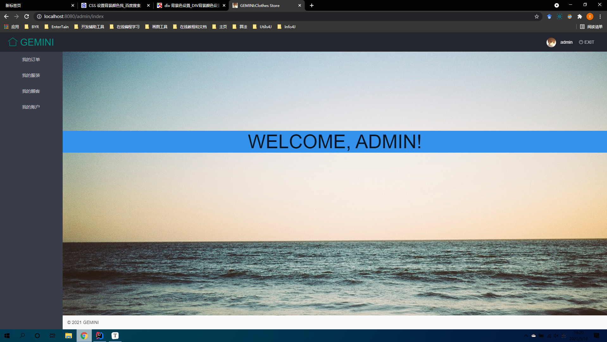
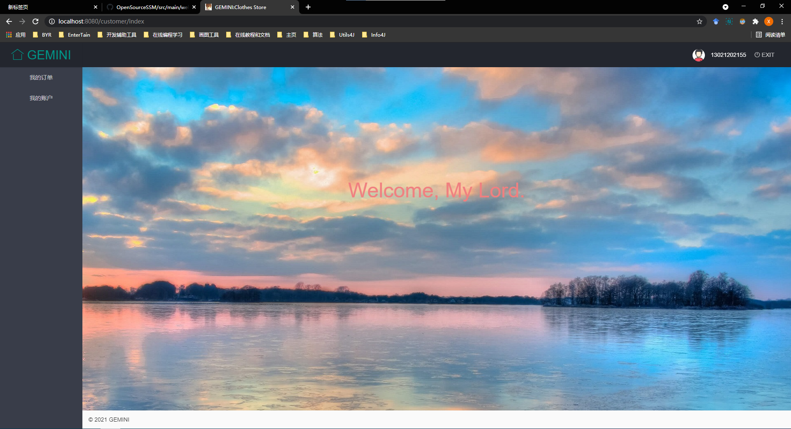

#### 该项目始于2021年5月14日15点30分

##### 2021年5月14日16点10分

构建项目，建立数据库，编写配置文件，完成SSM项目的整合。

##### 2021年5月14日16点30分

实现查找所有管理员的功能，完成项目的初步测试。

**提交0.0版本；**

##### 2021年5月15日16点54分

- 前端Layui：
  - 实现打开主页面转发到登陆界面；
  - 实现登录界面设计，添加界面图标；
  - 实现手机号合法性检测（即是否为11位），实现密码格式检测（仅支持字母和数字组合，不包含特殊字符），及密码长度检测（不低于6位）。
  - 注册功能尚未开放，仅支持鼠标滑过显示帮助信息。
  - 实现管理员登录验证功能，验证成功后跳转至管理员界面，客户登录验证功能尚未实现。
- 后端：
  - 添加根据username和password查询管理员的方法，该方法主要应用于登录验证业务。
  - 添加修改密码业务，前端页面尚未实现。

##### 2021年5月16日09点53分

- 前端：
  - 实现客户登录验证功能，验证成功后跳转至客户界面；
  - 设计管理员和用户初始界面；
- 后端：
  - 添加根据username和password查询客户的方法，该方法主要应用于登录验证业务。
  - 添加增加用户方法，目前客户为零，不方便测试；
- **提交0.1版本；**

##### 2021年5月16日15点18分

- 前端：

  - 完善管理员登录后跳转界面和用户登录后跳转界面；

  - 管理员登录后跳转界面：

    

  - 用户登录后跳转界面：

    

  - 登录页面美化（也可能是丑化haha~）：

    

- **提交0.2版本；**

##### 2021年5月17日

