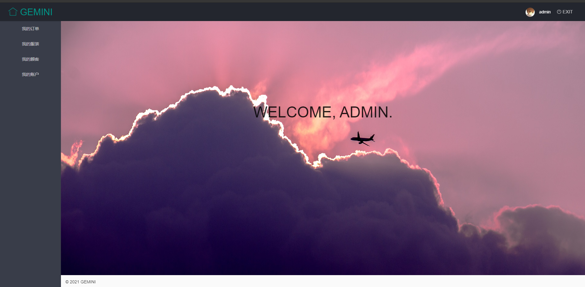
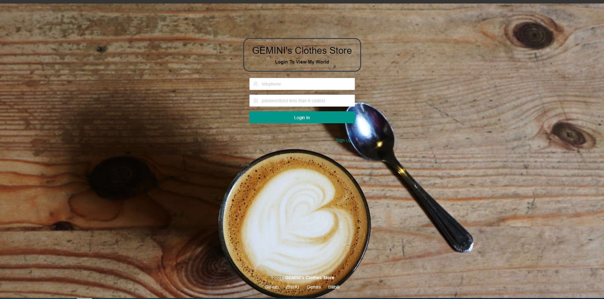
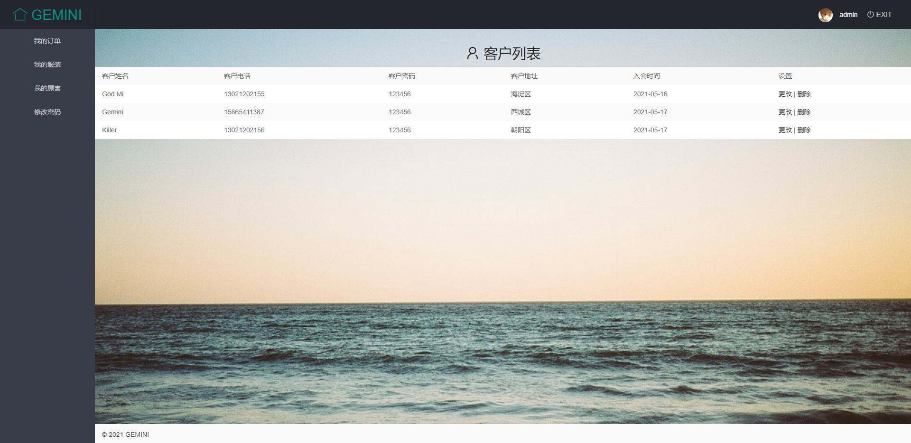
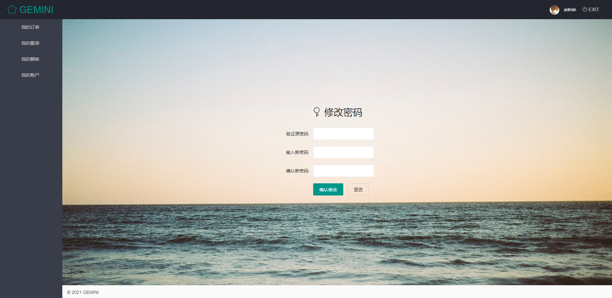
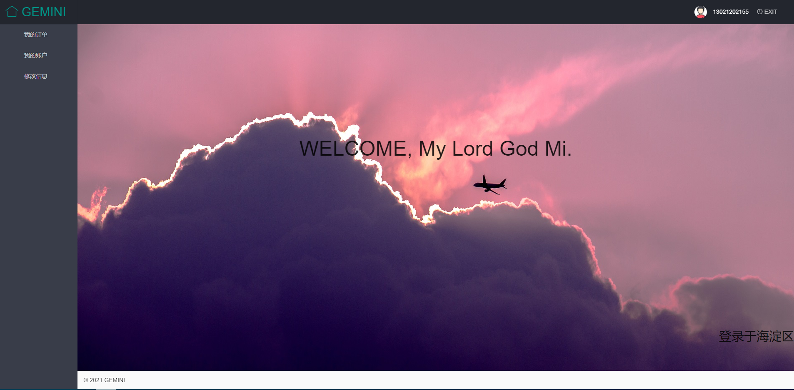
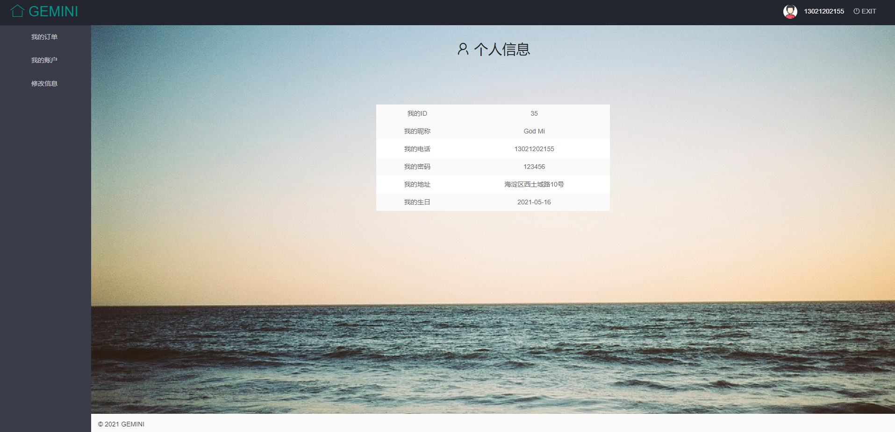
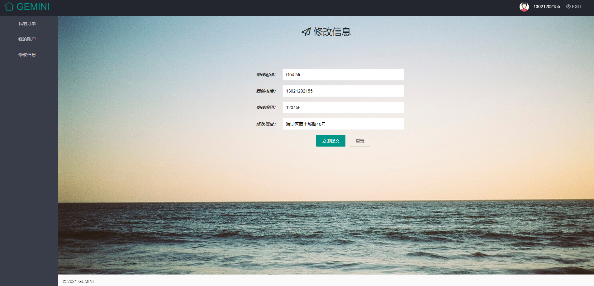

#### 该项目始于2021年5月14日15点30分

##### 2021年5月14日16点10分

构建项目，建立数据库，编写配置文件，完成SSM项目的整合。

##### 2021年5月14日16点30分

实现查找所有管理员的功能，完成项目的初步测试。

**提交0.0版本；**

##### 2021年5月15日16点54分

- 前端Layui：
  - 实现打开主页面转发到登陆界面；
  - 实现登录界面设计，添加界面图标；
  - 实现手机号合法性检测（即是否为11位），实现密码格式检测（仅支持字母和数字组合，不包含特殊字符），及密码长度检测（不低于6位）。
  - 注册功能尚未开放，仅支持鼠标滑过显示帮助信息。
  - 实现管理员登录验证功能，验证成功后跳转至管理员界面，客户登录验证功能尚未实现。
- 后端：
  - 添加根据username和password查询管理员的方法，该方法主要应用于登录验证业务。
  - 添加修改密码业务，前端页面尚未实现。

##### 2021年5月16日09点53分

- 前端：
  - 实现客户登录验证功能，验证成功后跳转至客户界面；
  - 设计管理员和用户初始界面；
- 后端：
  - 添加根据username和password查询客户的方法，该方法主要应用于登录验证业务。
  - 添加增加用户方法，目前客户为零，不方便测试；
- **提交0.1版本；**

##### 2021年5月16日15点18分

- 前端：

  - 完善管理员登录后跳转界面和用户登录后跳转界面；

  - 管理员登录后跳转界面：

    

  - 用户登录后跳转界面：

    

  - 登录页面美化（也可能是丑化haha~）：

    

- **提交0.2版本；**

##### 2021年5月17日20点17分

- 后端：
  - 完成在管理员界面我的客户栏显示客户的功能；
  - 实现查找所有Customer的业务，以便完成以上功能；
  - 完成管理员**修改密码**模块：
    - 原有密码验证功能；
    - 修改密码功能；
    - 重复确认密码一致功能；
- 前端：
  - 实现显示客户相应的页面；

    

  - 实现修改密码页面及其优化；

    
- **提交0.3版本；**

##### 2021年5月19日08点53分

- 前端：

  - 更改了网页LOGO；

    

  - 在主页显示客户的部分信息（姓名，地址等）；

    

  - 在我的账户页面显示用户全部信息；

  - 

  - 设计实现用户修改个人信息页面，可修改的信息有：

    - 地址
    - 姓名
    - 密码

    

- 后端：

  - 实现用户端修改个人信息的业务;
  - 手机号是唯一标识，实现根据手机号查询用户个人信息的业务；

- **提交1.0版本；**

- **提交1.1版本；**

- 截至目前实现的功能：

  - 管理员端：
    - 验证密码并登录；
    - 修改自己的管理员密码；
    - 查看所有客户的信息；
  - 客户端：
    - 验证密码并登录；
    - 主页面显示自己的部分信息：昵称，地址等；
    - 我的账户页面显示自己的全部信息；
    - 修改信息页面可以对部分信息（地址，密码，昵称）进行修改；

